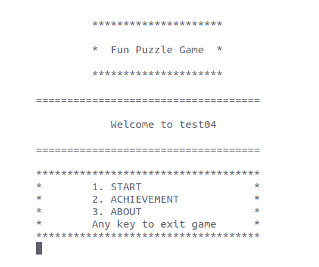
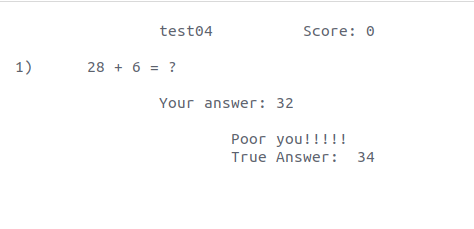
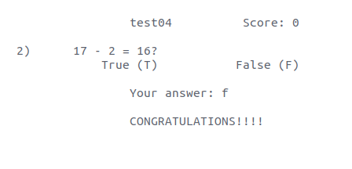
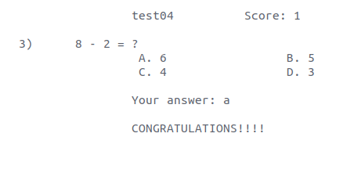
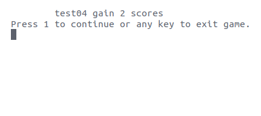
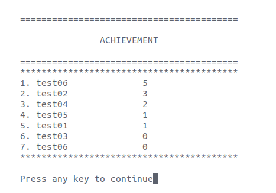

# FunPuzzleGame

An assignment in the Object-oriented programming course. The program execution image below:

<h2 align="center">Menu of Program</h2>

  

<h2 align="center">Questions</h2>

  
   
  
   
  

<h2 align="center">Finish</h2>

  

<h2 align="center">Leaderboard</h2>

  

